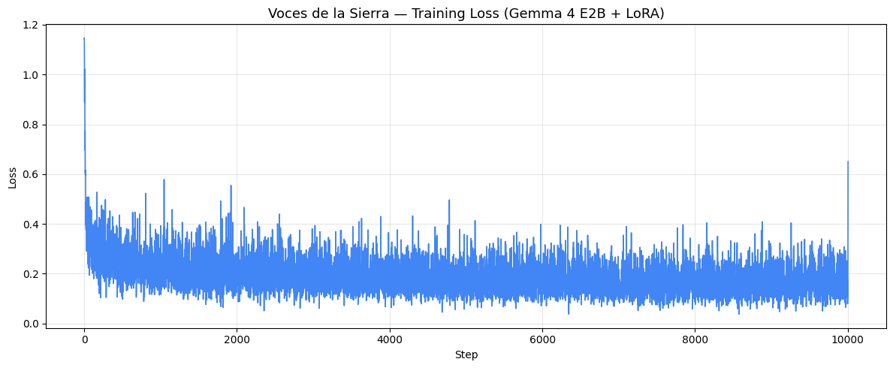

# Voces de la Sierra

**Bridging Languages, Preserving Cultures**

An offline bidirectional translator and cultural teacher for Spanish and Nahuatl.
Powered by Gemma 4 E2B · Fine-tuned with Unsloth · Deployed with llama.cpp

[](https://ai.google.dev/gemma)
[](https://github.com/unslothai/unsloth)
[](https://github.com/ggml-org/llama.cpp)
[](LICENSE)

**Gemma 4 Good Hackathon 2026** · Kaggle x Google DeepMind

**Tracks:** Digital Equity and Inclusivity · Future of Education

---

## The Problem

**1.7 million people speak Nahuatl in Mexico. Zero major translation platforms support their language.**

In the highland markets of Mexico's Sierra Norte, indigenous communities descend daily to interact with a Spanish-speaking world — hospitals, government offices, schools, markets — without any technological bridge for their language. Google Translate, DeepL, and Microsoft Translator do not support Nahuatl.

These communities exist in a technological blind spot: too small a market for commercial interest, too linguistically complex for simple rule-based systems, and too disconnected from the internet for cloud-dependent solutions.

**Voces de la Sierra was built to change that.**

---

## The Solution

Voces de la Sierra is a **bidirectional translator and cultural teaching assistant** that operates **100% offline** on consumer hardware. It has two modes:

| Mode | What it does | Example |
|------|-------------|---------|
| **Translator** | Direct, precise translations in both directions | "Translate to Nahuatl: water is life" → `inon quipia atl` |
| **Cultural Teacher** | Explains vocabulary, grammar, cultural context | "How do you say family?" → Nahuatl with usage and context |

The system detects user intent automatically: translation requests get concise answers; learning questions get patient, culturally-aware explanations.

---

## Architecture

TRAINING (Cloud)
Axolotl Dataset --> Quality Filter --> Bidirectional Formatting
(20,028 pairs)      (Nahuatl morph)    (67,288 examples)
Gemma 4 E2B-it --> QLoRA (r=8) --> 10,000 steps --> LoRA adapter
(4-bit, Unsloth)   (0.29% params)   (Colab T4 free)
DEPLOYMENT (Edge)
Gemma 4 E2B  +  LoRA Adapter  -->  llama-server (localhost:8080)
(Q4_K_M 1.8GB)   (GGUF 23MB)
[x] No internet required      [x] No cloud dependency
[x] No data leaves the device [x] Under 2GB total storage
[x] Works on any PC/laptop    [x] Full user privacy

---

## Technical Specifications

| Component | Details |
|-----------|---------|
| **Base Model** | Google Gemma 4 E2B-it (5.1B params, 4-bit quantized) |
| **Fine-tuning** | QLoRA via Unsloth · r=8, alpha=8, dropout=0 · 14.9M trainable params (0.29%) |
| **Dataset** | 67,288 examples from 20,028 Spanish-Nahuatl pairs (Axolotl + Bible UEDIN corpus) |
| **Training** | 10,000 steps · Google Colab T4 free tier · Checkpoint persistence via Drive |
| **Min Loss** | 0.0368 (step 8,574) · Final avg ~0.20 (last 1,000 steps) |
| **Inference** | llama.cpp server · 100% offline · ~2GB total · Web UI |
| **Export** | LoRA GGUF (23MB) + Base GGUF Q4_K_M (1.8GB) |

---

## Quick Start

### Option A: One-Click Windows (recommended for demo)

1. Download [llama.cpp release](https://github.com/ggml-org/llama.cpp/releases) for Windows (CPU version)
2. Copy all `.dll` files from the llama.cpp folder into your working folder
3. Download the [base model GGUF](https://huggingface.co/bartowski/google_gemma-4-E2B-it-GGUF) (~1.8GB)
4. Download the [LoRA adapter](https://drive.google.com/file/d/1OZmlRNr12vuHwJ8uLVuBV_3-PnkTlcGr/view?usp=sharing) (23MB)
5. Place all files in the same folder with `run_server.bat`
6. Double-click **`run_server.bat`**
7. Open **http://localhost:8080** in your browser

### Option B: Command Line
llama-server -m google_gemma-4-E2B-it-Q4_K_M.gguf --lora voces_sierra_lora_v2.gguf --chat-template gemma --port 8080

### Option C: Reproduce Training in Google Colab

[](https://colab.research.google.com/drive/18bfAb1piftFa2cS3eLmpgWO2jycBc6C3?usp=sharing)

---

## Models

| File | Size | Description | Download |
|------|------|-------------|----------|
| `google_gemma-4-E2B-it-Q4_K_M.gguf` | ~1.8 GB | Base model (Gemma 4 E2B quantized) | [HuggingFace](https://huggingface.co/bartowski/google_gemma-4-E2B-it-GGUF) |
| `voces_sierra_lora_v2.gguf` | 23 MB | Fine-tuned LoRA adapter (GGUF) | [Google Drive](https://drive.google.com/file/d/1OZmlRNr12vuHwJ8uLVuBV_3-PnkTlcGr/view?usp=sharing) |
| `adapter_model.safetensors` | 46 MB | LoRA adapter (PEFT format, for retraining) | [Google Drive](https://drive.google.com/file/d/1eMsXtk6TdQW2j0FQxqqAwf_1z61iSQ-o/view?usp=sharing) |

---

## Training Results

Trained for 10,000 steps on Google Colab's free T4 GPU. A checkpoint persistence system saves to Google Drive every 500 steps, enabling training to resume across multiple 5-hour sessions.

| Metric | Value |
|--------|-------|
| Final checkpoint | checkpoint-10004 |
| Steps logged | 10,003 (every 50 steps) |
| Initial loss | 1.1443 (step 1) |
| Min loss | **0.0368** (step 8,574) |
| Final avg loss | ~0.20 (last 1,000 steps) |
| LoRA parameters | 706 total |
| Adapter size | 46.1 MB (safetensors) / 23.1 MB (GGUF) |
| GPU | Tesla T4 (Colab free tier) |
| Training time | ~6 hours across multiple sessions |



> The spike at step 10,003 (loss 0.65) is a single noisy batch and not representative of model quality.
> The sustained average in the final 2,000 steps is ~0.20, confirming stable convergence.

### Verified Translations (checkpoint-10004)

| Input | Output | Verification |
|-------|--------|--------------|
| "Translate to Nahuatl: water is life" | `inon quipia atl` | "atl" = water, "quipia" = holds/has — authentic Nahuatl |
| "Translate to Spanish: Auh in ye yuhqui" | `Y en verdad que es asi` | Correct translation |
| "How do you say 'family' in Nahuatl?" | `in itechcopa notlajsojcaicnihuan` | Real Nahuatl morphology, no repetition loop |

---

## Impact

### Who This Serves

- **Primary:** 1.7M Nahuatl speakers needing Spanish communication (hospitals, markets, government)
- **Secondary:** Bilingual educators in indigenous schools
- **Tertiary:** Linguists, cultural preservation organizations, language learners

### Why Offline Matters

In Mexico's Sierra Norte, Sierra de Oaxaca, and Huasteca regions, internet connectivity ranges from unreliable to nonexistent. Voces de la Sierra runs entirely on-device — no API calls, no server dependencies, no data leaving the user's hands. Indigenous communities have historically had their linguistic data extracted without consent. Our system keeps all interactions local.

### Scalability

The pipeline is language-agnostic. Mexico alone has 68 indigenous language groups with 364 variants. Globally, UNESCO estimates 40% of approximately 6,700 languages are endangered. Voces de la Sierra provides a replicable template for preserving any of them through accessible AI.

---

## Challenges Solved

| Challenge | Solution |
|-----------|----------|
| Gemma 4 E2B OOM on T4 GPU | Unsloth T4 config: max_seq=1024, r=8, dropout=0 |
| 5-hour Colab session limit | Checkpoint persistence to Google Drive every 500 steps |
| GGUF export fails with bitsandbytes | Custom pipeline: text-only LoRA extraction, tensor renaming, 16-bit base conversion |
| Nahuatl dialectal variation in dataset | Morphological regex validator for -tl, -tzin, -tli morphemes |
| Gemma 4 multimodal tokenizer mismatch | Manual chat template with verified start_of_turn token strings |
| Unsloth MLX compilation bug | Disabled torch dynamo via TORCHDYNAMO_DISABLE=1 before any imports |

---

## Future Roadmap

1. **Voice Input** — Gemma 4 E2B supports audio natively via USM encoder. When llama.cpp adds audio support, users can speak Nahuatl directly.
2. **Android APK** — Standalone app using llama.cpp Android bindings for direct phone installation on low-end devices.
3. **Expanded Datasets** — Partner with INALI and CIESAS for larger, dialect-labeled corpora.
4. **Multi-language** — Apply the same pipeline to Mixtec, Zapotec, Maya, and other endangered Mexican indigenous languages.

---

## Repository Structure

```
voces-de-la-sierra/
├── README.md
├── LICENSE
├── run_server.bat
├── Modelfile
├── assets/
│   └── loss_curve.png
├── notebooks/
│   └── Voces_de_la_Sierra_Training.ipynb
├── docs/
│   └── Voces_de_la_Sierra_Writeup.pdf
└── demo/
    └── video_link.md
```

---

## License

This project is licensed under the **Apache License 2.0** — see [LICENSE](LICENSE) for details.

**Gemma is a trademark of Google LLC.** This project uses the Gemma 4 E2B model under Google's Gemma Terms of Use. The fine-tuned adapter weights are distributed under Apache 2.0.

---

## Acknowledgments

- **Google DeepMind** — Gemma 4 open models
- **Unsloth** — Efficient fine-tuning framework
- **SomosNLP** — Axolotl Spanish-Nahuatl parallel dataset
- **ggml-org** — llama.cpp inference engine
- **The Nahuatl-speaking communities of Mexico** — whose voices deserve to be heard

---

## Author

**Anthony Jair Torres Rosas**

Digital Transformation Consultant and AI/App Development Specialist

*"The most powerful AI in the world should work for the people who have the least."*

---

Built with love for the [Gemma 4 Good Hackathon](https://www.kaggle.com/competitions/gemma-4-good-hackathon) · Kaggle x Google DeepMind · 2026

*Gemma is a trademark of Google LLC.*
